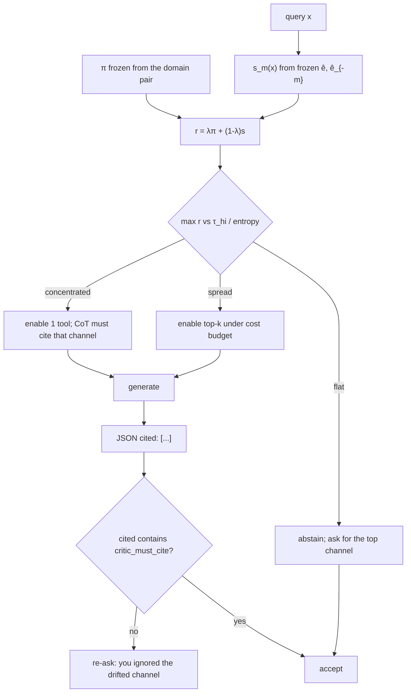

# Gap-guided LLM inference

Stage-1 gap scores are not another attention heatmap. They are a **frozen routing contract** for a model that can only inspect *k* channels (tools, RAG indices, prompt sections).

This is deployable without touching LLM weights.

## What is frozen

Fit once on a domain pair \(W\in\{0,1\}\) (two corpora, two vendors, two years):

| score | formula | when it is used |
|---|---|---|
| \(\pi_m\) | consensus simplex over blocks \(B_m\) | population prior: which channel drifted |
| \(s_m(x)\) | \(\lvert\hat e(x)-\hat e(x_{-m})\rvert / \sum_{m'}\lvert\cdot\rvert\) | this example: which channel moved the propensity |
| \(r_m(x)\) | \(\lambda\pi_m + (1-\lambda)s_m(x)\) | the actual gate (\(\lambda=0.4\) default) |
| \(Z_m(x)\) | \(\pi_m\cdot\mathrm{logit}\,\hat e_m(x_m)\) | numeric sidecar in the prompt, not a tool |
| \(H_m\) | TMLE clever covariate | **training** of \(P(Y\mid X)\), not the chat loop |

\(\hat e\) is \(P(W=1\mid X)\), not \(P(Y\mid X)\). That is the point: routing is driven by *where the world moved*, not by where the label model already looks.

## Online loop (one query)



Concrete gates (defaults in `RouterConfig`):

- \(\tau_{\mathrm{hi}}=0.42\): one tool only.
- cost budget \(4.0\), \(k_{\max}=2\): greedy by \(r_m/\mathrm{cost}\) (text dumps are expensive; lexicon lookups are cheap).
- entropy \(\ge 0.92\log M\) or \(r_{\max}<\tau_{\mathrm{lo}}\): **abstain**, do not guess from a low-share channel.

The LLM never sees \(W\). It sees \(\pi\), \(s\), \(r\), the enabled tool schema, and \(Z\).

## Where this plugs in

| surface | what \(\pi,s\) do |
|---|---|
| Tool calling | Drop low-share functions from the schema. The model cannot call `read_tokens` if valence is the gate. |
| RAG | Each block is an index. Query only `index_{m*}` (Chronoberg: VAD lexicon vs full-text; MNLI: overlap checker vs premise dump). |
| Context packing | Concatenate only \(B_m\) for enabled \(m\). This is the one-block expert in the stand-in eval. |
| CoT read-order | Force the first sentence to name \(m^*=\arg\max r_m\) and cite \(\pi,s\). |
| Critic / second pass | If `cited` misses `critic_must_cite`, regenerate with a fixed re-ask string. |
| Abstain / HITL | Flat \(r\) → ask for the missing sensor (VAD scores, overlap table, hours-worked). |
| Outcome heads | Keep \(H_m\) for TMLE / PO-risk when you *train* \(P(Y\mid X)\). Do not put \(H_m\) in the chat prompt (it uses \(W\)). |

Worked Chronoberg mapping: `text → read_tokens` (cost 3), `valence → vad_valence` (cost 1). If \(r_{\mathrm{valence}}\) is large, the system prompt disables `read_tokens` and the critic rejects a lexical-only argument.

Worked MNLI mapping: `overlap → lexical_overlap`. A fiction vs telephone shift that lives in overlap should not be answered by re-reading the premise first.

## Prompt contract (copy-paste)

`Python/src/gap_guided_inference.py` → `render_system_prompt` / `openai_tool_schema`. A generated example lives in `results/gap_guided_inference/example_system_prompt.txt`.

The first reasoning sentence is specified, not hoped for. The trailing `{"cited": [...], "confidence": 0-1}` line is what the critic parses. No JSON in the schema beyond that.

## What “better reasoning” means here

Not higher MMLU. Three falsifiable claims, in order:

1. **Hit rate.** Under a one-tool budget, \(P(m^*=\mathrm{GT})\) for blend / \(\pi\) beats RF-VIMP and random when the shift is concentrated and a wide nuisance block exists (VIMP overweights width).
2. **Budgeted AUC.** A frozen expert that only reads the routed block has higher domain AUC than a VIMP-routed or random-routed expert. Oracle GT block is the ceiling.
3. **Negative control.** Shuffle the GT block: hit rate on that name must collapse. If it does not, the router is using width / prior names, not gap.

Headline from `scripts/run_gap_guided_inference.py` (wide text + inject valence, 3 seeds): **VIMP hit rate 0 / AUC 0.60**; **π hit rate 1 / AUC 0.75** (matches the oracle GT block). Shuffle-valence collapses the hit rate. Strong synthetic GT is too easy (both π and VIMP find valence); inject with a wide nuisance block is the shipping check.

Diffuse observational shift (Chronoberg 1750 vs 1950) is **not** a routing win. Same honesty as Stage-2: ship the gate on concentrated channel shift; keep \(\pi\) as a prior, not a dictator, when \(H(r)\) is high.

## Code

```bash
python3 -m pytest -q tests/test_gap_guided_inference.py tests/test_clever_covariate_gap.py
python3 scripts/run_gap_guided_inference.py
```

- `fit_frozen_gap` / `predict_gap_scores` — deployable \(\hat e,\hat e_{-m}\)
- `GapGuidedRouter` — packet, prompt, OpenAI tool filter, critic
- `budgeted_inference_eval` — one-block expert board (no LLM vendor)
