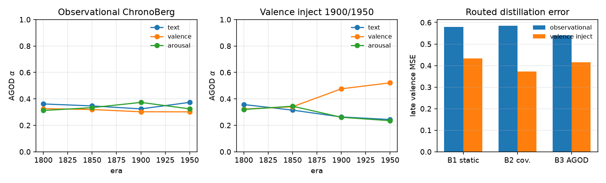

# ChronoBerg AGOD prototype

Labels for PO-risk: `Y = np.arange(n)` (then standardized) on stacked reference + current window.

ChronoBerg test splits are chunked into 80-token passages. Modalities are hashed **text** plus period-calibrated **valence** / **arousal** (the corpus has no audio/image).

| Protocol | B1 MSE | B2 MSE | B3 AGOD MSE | B1 late val. | B2 late val. | B3 late val. |
|----------|--------|--------|-------------|--------------|--------------|--------------|
| observational | 0.631 | 0.630 | 0.637 | 0.579 | 0.584 | **0.540** |
| valence inject | 0.642 | **0.596** | 0.638 | 0.432 | **0.372** | 0.415 |

On natural era drift, AGOD slightly lowers late-window valence error. After a valence mean-shift in 1900/1950, domain AUC on valence hits 1.0 (covariate-shift dominated), so B2 (AUC-only routing) is the strongest of the three — matching the method note that AGOD's PO-risk term matters most when concept drift dominates covariate shift.

