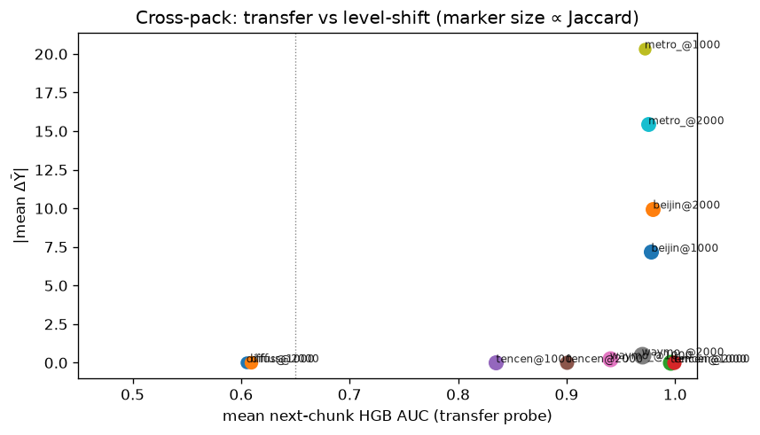
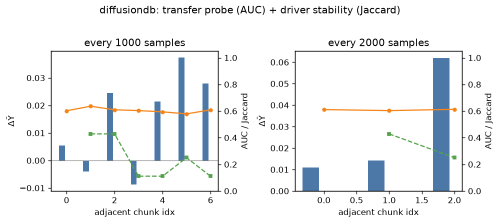
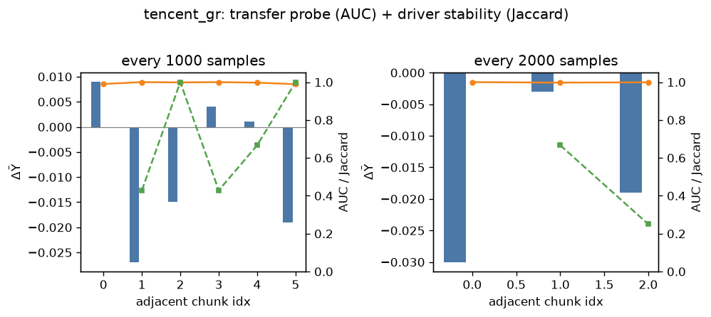
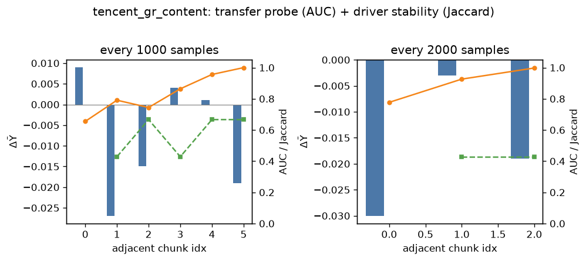
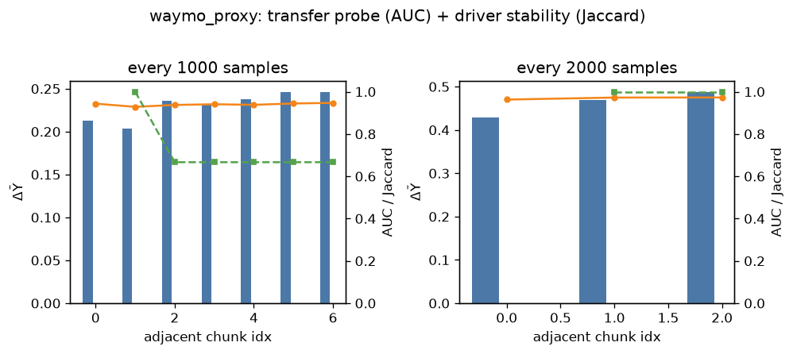
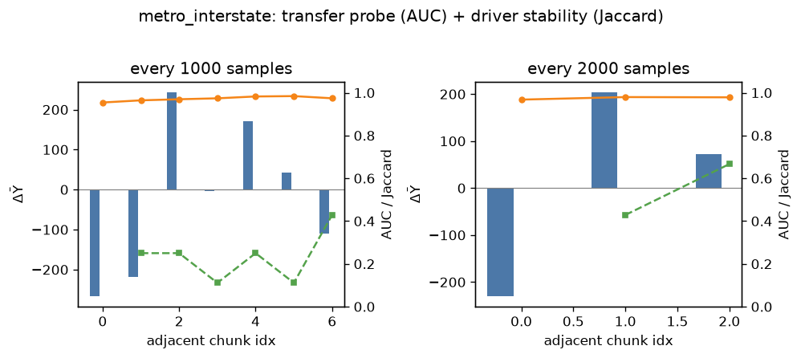
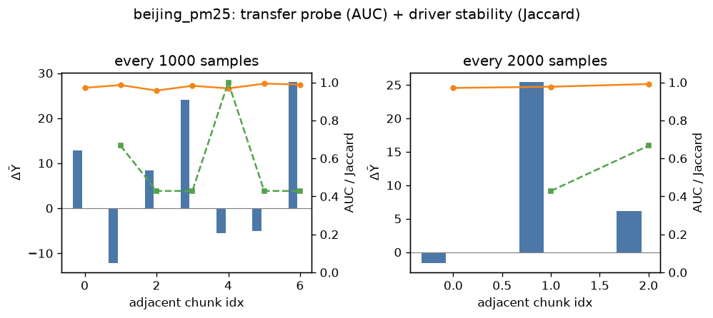

# Sample-chunk adjacent boards (multi-dataset)

HGB AUC = next-chunk transfer probe after SelectKBest on chunk t; not a causal tip / not a production model. Read with ΔȲ and Jaccard.

| pack@N | mean AUC | |ΔȲ| | Jaccard | reading |
|---|---:|---:|---:|---|
| diffusiondb@1000 | 0.605 | 0.01484 | 0.24 | weak transfer (association does not travel) |
| diffusiondb@2000 | 0.609 | 0.02907 | 0.34 | weak transfer (association does not travel) |
| tencent_gr@1000 | 0.996 | 0.007833 | 0.70 | strong transfer + stable top feats (persistent drivers) |
| tencent_gr@2000 | 0.999 | 0.01733 | 0.46 | transfer holds; feature set partially stable |
| tencent_gr_content@1000 | 0.835 | 0.007833 | 0.57 | strong transfer + stable top feats (persistent drivers) |
| tencent_gr_content@2000 | 0.900 | 0.01733 | 0.43 | transfer holds; feature set partially stable |
| waymo_proxy@1000 | 0.940 | 0.2307 | 0.72 | strong transfer + stable top feats (persistent drivers) |
| waymo_proxy@2000 | 0.969 | 0.4618 | 1.00 | strong transfer + stable top feats (persistent drivers) |
| metro_interstate@1000 | 0.972 | 20.37 | 0.23 | strong transfer but shifting drivers (regime / composition change) |
| metro_interstate@2000 | 0.975 | 15.45 | 0.55 | strong transfer + stable top feats (persistent drivers) |
| beijing_pm25@1000 | 0.978 | 7.191 | 0.56 | strong transfer + stable top feats (persistent drivers) |
| beijing_pm25@2000 | 0.980 | 9.98 | 0.55 | strong transfer + stable top feats (persistent drivers) |

---

## diffusiondb
- meta: `{'dataset': 'diffusiondb', 'y': 'image_nsfw', 'sort': 'timestamp', 'n': 8000, 'read_as': 'low AUC expected: prompt tokens weakly transfer for NSFW'}`
- 

### every 1000 samples
- pairs=7 · mean AUC=0.6048427572700964 · mean Jaccard=0.2400793650793651 · **weak transfer (association does not travel)**

| t0→t1 | n0/n1 | ΔȲ | AUC | Jaccard | top_fsds |
|---|---|---:|---:|---:|---|
| 0→1 | 1000/1000 | 0.0054 | 0.602 | — | mucha, alphonse mucha, alphonse |
| 1→2 | 1000/1000 | -0.0040 | 0.636 | 0.43 | alphonse, alphonse mucha, mucha |
| 2→3 | 1000/1000 | 0.0246 | 0.610 | 0.43 | alphonse, alphonse mucha, mucha |
| 3→4 | 1000/1000 | -0.0088 | 0.604 | 0.11 | artgerm, mucha, by artgerm |
| 4→5 | 1000/1000 | 0.0214 | 0.594 | 0.11 | mucha, girl, female |
| 5→6 | 1000/1000 | 0.0374 | 0.579 | 0.25 | dress, white, woman |
| 6→7 | 1000/1000 | 0.0280 | 0.609 | 0.11 | fashion, body, young |

### every 2000 samples
- pairs=3 · mean AUC=0.6091376939024363 · mean Jaccard=0.3392857142857143 · **weak transfer (association does not travel)**

| t0→t1 | n0/n1 | ΔȲ | AUC | Jaccard | top_fsds |
|---|---|---:|---:|---:|---|
| 0→1 | 2000/2000 | 0.0110 | 0.611 | — | alphonse mucha, alphonse, mucha |
| 1→2 | 2000/2000 | 0.0142 | 0.603 | 0.43 | mucha, alphonse, alphonse mucha |
| 2→3 | 2000/2000 | 0.0621 | 0.613 | 0.25 | dress, woman, mucha |

## tencent_gr
- meta: `{'dataset': 'tencent_gr_ops', 'y': 'y_convert', 'sort': 'e_last_ts', 'n': 8000, 'd': 35, 'dropped_volume': [], 'read_as': 'high AUC usually = exposure/click intensity transfers; not a content tip'}`
- 

### every 1000 samples
- pairs=6 · mean AUC=0.9957951724897706 · mean Jaccard=0.7047619047619047 · **strong transfer + stable top feats (persistent drivers)**

| t0→t1 | n0/n1 | ΔȲ | AUC | Jaccard | top_fsds |
|---|---|---:|---:|---:|---|
| 0→1 | 1000/1000 | 0.0090 | 0.990 | — | e_log1p_exp, e_n_exp, i_log1p_n_exp |
| 1→2 | 1000/1000 | -0.0270 | 1.000 | 0.43 | e_log1p_exp, e_n_exp, i_log1p_n_exp |
| 2→3 | 1000/1000 | -0.0150 | 0.999 | 1.00 | e_n_exp, e_log1p_exp, u_n_exp |
| 3→4 | 1000/1000 | 0.0040 | 1.000 | 0.43 | e_log1p_exp, e_n_exp, u_n_exp |
| 4→5 | 1000/1000 | 0.0010 | 0.997 | 0.67 | e_log1p_exp, e_n_exp, i_credit_last |
| 5→6 | 1000/1000 | -0.0190 | 0.989 | 1.00 | e_log1p_exp, e_n_exp, i_share_last |

### every 2000 samples
- pairs=3 · mean AUC=0.9987730084570958 · mean Jaccard=0.4583333333333333 · **transfer holds; feature set partially stable**

| t0→t1 | n0/n1 | ΔȲ | AUC | Jaccard | top_fsds |
|---|---|---:|---:|---:|---|
| 0→1 | 2000/2000 | -0.0300 | 1.000 | — | e_log1p_exp, e_n_exp, i_log1p_n_exp |
| 1→2 | 2000/2000 | -0.0030 | 0.997 | 0.67 | e_n_exp, e_log1p_exp, u_n_exp |
| 2→3 | 2000/2000 | -0.0190 | 0.999 | 0.25 | e_log1p_exp, e_n_exp, i_share_last |

## tencent_gr_content
- meta: `{'dataset': 'tencent_gr_content', 'y': 'y_convert', 'sort': 'e_last_ts', 'n': 8000, 'd': 14, 'dropped_volume': ['e_ctr', 'e_log1p_clk', 'e_log1p_exp', 'e_n_clk', 'e_n_exp', 'i_ctr', 'i_item_pop_rank', 'i_log1p_n_clk', 'i_log1p_n_exp', 'i_log1p_n_users', 'i_n_clk', 'i_n_exp', 'i_n_users', 'u_ctr', 'u_log1p_n_clk', 'u_log1p_n_events', 'u_log1p_n_exp', 'u_n_clk', 'u_n_events', 'u_n_exp', 'u_user_activity_rank'], 'read_as': 'volume dropped; AUC should fall if intensity was the only transferable signal'}`
- 

### every 1000 samples
- pairs=6 · mean AUC=0.8350687106424594 · mean Jaccard=0.5714285714285714 · **strong transfer + stable top feats (persistent drivers)**

| t0→t1 | n0/n1 | ΔȲ | AUC | Jaccard | top_fsds |
|---|---|---:|---:|---:|---|
| 0→1 | 1000/1000 | 0.0090 | 0.655 | — | i_credit_last, i_share_last, i_item_credit_rank |
| 1→2 | 1000/1000 | -0.0270 | 0.791 | 0.43 | i_credit_last, i_share_last, i_item_credit_rank |
| 2→3 | 1000/1000 | -0.0150 | 0.744 | 0.67 | i_credit_last, i_share_last, i_item_credit_rank |
| 3→4 | 1000/1000 | 0.0040 | 0.864 | 0.43 | i_credit_last, i_share_last, i_item_credit_rank |
| 4→5 | 1000/1000 | 0.0010 | 0.956 | 0.67 | i_credit_last, i_share_last, i_item_credit_rank |
| 5→6 | 1000/1000 | -0.0190 | 1.000 | 0.67 | i_share_last, i_credit_last, i_item_credit_rank |

### every 2000 samples
- pairs=3 · mean AUC=0.9003182536545639 · mean Jaccard=0.42857142857142855 · **transfer holds; feature set partially stable**

| t0→t1 | n0/n1 | ΔȲ | AUC | Jaccard | top_fsds |
|---|---|---:|---:|---:|---|
| 0→1 | 2000/2000 | -0.0300 | 0.777 | — | i_share_last, i_credit_last, i_item_credit_rank |
| 1→2 | 2000/2000 | -0.0030 | 0.926 | 0.43 | i_share_last, i_credit_last, i_item_credit_rank |
| 2→3 | 2000/2000 | -0.0190 | 0.997 | 0.43 | i_share_last, i_credit_last, i_item_credit_rank |

## waymo_proxy
- meta: `{'dataset': 'waymo_proxy', 'y': 'proxy_y', 'sort': 'row_index', 'n': 8000, 'd': 9, 'read_as': 'synthetic gradual drift; high AUC+Jaccard = planted kinematics persist'}`
- 

### every 1000 samples
- pairs=7 · mean AUC=0.9399096272322387 · mean Jaccard=0.7222222222222222 · **strong transfer + stable top feats (persistent drivers)**

| t0→t1 | n0/n1 | ΔȲ | AUC | Jaccard | top_fsds |
|---|---|---:|---:|---:|---|
| 0→1 | 1000/1000 | 0.2131 | 0.943 | — | x0, x8, x3 |
| 1→2 | 1000/1000 | 0.2036 | 0.928 | 1.00 | x0, x8, x3 |
| 2→3 | 1000/1000 | 0.2359 | 0.937 | 0.67 | x0, x8, x3 |
| 3→4 | 1000/1000 | 0.2322 | 0.941 | 0.67 | x0, x8, x3 |
| 4→5 | 1000/1000 | 0.2373 | 0.938 | 0.67 | x0, x8, x5 |
| 5→6 | 1000/1000 | 0.2465 | 0.944 | 0.67 | x0, x8, x3 |
| 6→7 | 1000/1000 | 0.2465 | 0.947 | 0.67 | x0, x8, x3 |

### every 2000 samples
- pairs=3 · mean AUC=0.9692848500223602 · mean Jaccard=1.0 · **strong transfer + stable top feats (persistent drivers)**

| t0→t1 | n0/n1 | ΔȲ | AUC | Jaccard | top_fsds |
|---|---|---:|---:|---:|---|
| 0→1 | 2000/2000 | 0.4281 | 0.963 | — | x0, x8, x5 |
| 1→2 | 2000/2000 | 0.4688 | 0.972 | 1.00 | x0, x8, x5 |
| 2→3 | 2000/2000 | 0.4884 | 0.973 | 1.00 | x0, x8, x5 |

## metro_interstate
- meta: `{'dataset': 'metro_interstate', 'y': 'traffic_volume', 'sort': 'date_time', 'n': 8000, 'd': 19, 'read_as': 'hourly traffic; calendar/weather feats should transfer across adjacent hours'}`
- 

### every 1000 samples
- pairs=7 · mean AUC=0.9718807034328297 · mean Jaccard=0.2334656084656085 · **strong transfer but shifting drivers (regime / composition change)**

| t0→t1 | n0/n1 | ΔȲ | AUC | Jaccard | top_fsds |
|---|---|---:|---:|---:|---|
| 0→1 | 1000/1000 | -267.1500 | 0.954 | — | m5, m0, m14 |
| 1→2 | 1000/1000 | -218.6630 | 0.964 | 0.25 | m5, m9, m3 |
| 2→3 | 1000/1000 | 243.3420 | 0.970 | 0.25 | m5, m6, m12 |
| 3→4 | 1000/1000 | -3.7380 | 0.974 | 0.11 | m5, m0, m16 |
| 4→5 | 1000/1000 | 171.8230 | 0.983 | 0.25 | m5, m14, m10 |
| 5→6 | 1000/1000 | 42.4760 | 0.984 | 0.11 | m5, m0, m9 |
| 6→7 | 1000/1000 | -110.6580 | 0.974 | 0.43 | m5, m1, m9 |

### every 2000 samples
- pairs=3 · mean AUC=0.9753765691624277 · mean Jaccard=0.5476190476190476 · **strong transfer + stable top feats (persistent drivers)**

| t0→t1 | n0/n1 | ΔȲ | AUC | Jaccard | top_fsds |
|---|---|---:|---:|---:|---|
| 0→1 | 2000/2000 | -230.5670 | 0.968 | — | m5, m0, m6 |
| 1→2 | 2000/2000 | 203.8445 | 0.980 | 0.43 | m5, m6, m0 |
| 2→3 | 2000/2000 | 73.0585 | 0.979 | 0.67 | m5, m0, m6 |

## beijing_pm25
- meta: `{'dataset': 'beijing_pm25', 'y': 'pm2.5', 'sort': 'stamp', 'n': 8000, 'd': 13, 'read_as': 'meteo+lag; high transfer expected under smooth pollution regimes'}`
- 

### every 1000 samples
- pairs=7 · mean AUC=0.9780904023588342 · mean Jaccard=0.5634920634920634 · **strong transfer + stable top feats (persistent drivers)**

| t0→t1 | n0/n1 | ΔȲ | AUC | Jaccard | top_fsds |
|---|---|---:|---:|---:|---|
| 0→1 | 1000/1000 | 12.7520 | 0.971 | — | p8, p0, p2 |
| 1→2 | 1000/1000 | -12.2280 | 0.986 | 0.67 | p8, p2, p0 |
| 2→3 | 1000/1000 | 8.3620 | 0.957 | 0.43 | p8, p0, p10 |
| 3→4 | 1000/1000 | 24.0380 | 0.982 | 0.43 | p8, p0, p7 |
| 4→5 | 1000/1000 | -5.5500 | 0.968 | 1.00 | p8, p0, p10 |
| 5→6 | 1000/1000 | -5.0780 | 0.993 | 0.43 | p8, p0, p10 |
| 6→7 | 1000/1000 | 28.0400 | 0.989 | 0.43 | p8, p0, p2 |

### every 2000 samples
- pairs=3 · mean AUC=0.9797058426155137 · mean Jaccard=0.5476190476190476 · **strong transfer + stable top feats (persistent drivers)**

| t0→t1 | n0/n1 | ΔȲ | AUC | Jaccard | top_fsds |
|---|---|---:|---:|---:|---|
| 0→1 | 2000/2000 | -1.6710 | 0.971 | — | p8, p0, p2 |
| 1→2 | 2000/2000 | 25.4440 | 0.977 | 0.43 | p8, p0, p10 |
| 2→3 | 2000/2000 | 6.1670 | 0.991 | 0.67 | p8, p0, p10 |

